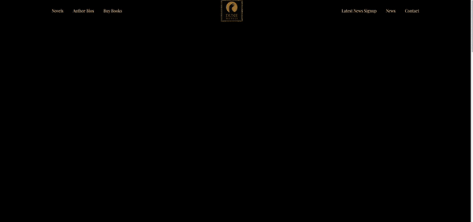

# Dune Movie Website

In this project, we will create a responsive website using HTML5, CSS3, and Sass/SCSS to clone the Dune novels website. The project utilizes Sass's nesting capabilities and partials to achieve a more streamlined and well-structured codebase.

## Project Content

1. **Introduction & Project Overview**
2. **Project Structure**
3. **Install Sass Extension and Setup Sass**
4. **Creating Sass Partial Files**
5. **Website Sass Variables**
6. **Website Configuration Sass File**
7. **Sass Utilities Partial File**
8. **Creating Comments in Sass/SCSS**
9. **Sass Text Alignment Classes**
10. **Background Color Classes**
11. **Sass Mixin**
12. **Margin Classes**
13. **Create the Website Navigation Bar using Sass**
14. **Navigation Component**
15. **Website Header**
16. **Website Movie Section**
17. **Sass Button Component**
18. **Sass Form Component**
19. **Create the Subscribe Form using HTML and Sass Classes**
20. **Make Website Responsive using @media Query**

## Useful Links

- [Bootstrap 5 CDN](https://getbootstrap.com/)
- [Google Fonts](https://fonts.google.com/)
- [Font Awesome](https://fontawesome.com/)

## Live Demo

Check out the live demo of the website [here](https://zbaharyilmaz.github.io/dune-movie-website/).

## Visual

